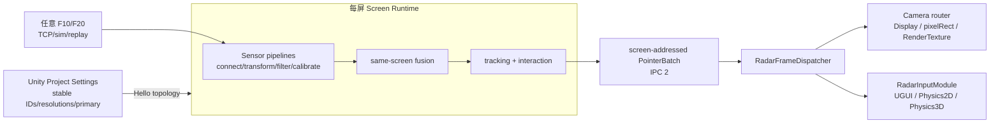

# 1.2.10 架构与线程模型

## 所有权边界

`RadarBridge.exe` 是雷达 TCP、Schema 2 配置、每传感器处理和每屏融合的唯一所有者。Unity 不连接 `192.168.0.100:8487`，只通过 `Yuexin.RadarBridge` Named Pipe IPC 2 发布逻辑屏幕 topology 并消费 PointerBatch。

LEFT/L1、FRONT/F1+F2 overlap、RIGHT/R1 中，F1/F2 是 FRONT 内的两个独立 pipeline；各自映射到 FRONT OutputRect 后在该屏 fusion/tracker 去重。其他屏幕不因其中一个雷达断线而停止。Pointer ID 的稳定域是 Screen，不跨屏关联人员。

## 模块职责

| 项目 | 职责 |
| --- | --- |
| `Radar.Contracts` | Schema 2 配置、screen/sensor DTO、IPC 2 envelope 与 PointerBatch |
| `Radar.Device` / `Radar.Protocol` | 每 Sensor TCP 生命周期、F10/F20 解码、重连、录制/回放 |
| `Radar.Processing` | transform/filter/calibration、输出矩形、同屏融合与跟踪 |
| `Radar.Configuration` | Schema 2 校验、持久化与迁移 |
| `Radar.Ipc` | 长度前缀 JSON、v2 Hello/HelloAck、心跳和 Named Pipe server |
| `Radar.Bridge.Wpf` | Screen/Sensor runtime 协调、操作界面、软件渲染与 tagged logs |
| `Blaze.Radar` Unity Runtime | topology、Bridge launcher/client、按屏 dispatcher/input/camera routing |

## 并发、背压和拓扑变更

- 每 Sensor 异步接收，重连前清空解析器；容量 1 最新值缓冲避免积压过时扫描。
- 每 Screen scheduler 只融合未超过 data max age 的 detections，按该屏 output rate 发布；跟踪参数不跨屏共享。
- Hello/HelloAck 完成后才发布业务帧。Topology/分辨率/OutputRect 变更先输出 Pointer Up/reset transition，再应用新像素空间。
- WPF 只消费不可变快照并用自绘控件显示；窗口创建前强制软件渲染，日志通过有界异步通道写入。
- Unity client 保留最新 PointerBatch，记录替换的 dropped count；Camera router 和 EventSystem 在 Unity 主线程派发。

## 生命周期与可观测性

启动：读取/迁移 Schema 2 → 日志/DI → 每屏/每 Sensor runtime → IPC server → 软件渲染 WPF。Unity Launcher 先探测 Pipe，只在需要时启动当前 Resolved Package 内 Bridge，并传 `--parent-pid`。停止：取消 active pointers → 停传感器/调度/IPC → 保存配置/刷新日志；父进程结束时 Bridge 返回 code 0。

IPC 身份边界：Bridge 的 Named Pipe 以 `CurrentUserOnly` 创建，并从 Windows 管道句柄读取真实客户端 PID/Session。真实 PID 必须与 Hello 声明一致、客户端必须与 Bridge 同 Session；由 Unity 自动启动时，真实 PID 还必须与 `--parent-pid` 一致。手工启动未提供 `--parent-pid` 时，只能保证当前用户、同 Session 与真实 PID/Hello 一致；同一交互登录用户下的其他进程仍可能发起诚实声明的连接，因此手工模式的信任边界弱于自动启动模式。

Bridge 使用 `[SCREEN/SENSOR]`、`[GLOBAL/IPC]` 标签。与 `Player.log` 的 SDK/Bridge/IPC、screenId、batch/frame sequence、pointer/dropped count 和 latency 对齐。安装固定标签为 `https://github.com/blaze-tc/RadarControl.git?path=/UnityPackage/com.blaze.radar#v1.2.10`；构建处理器从当前 Package Manager Resolved Path 复制完整 Bridge 并验证 1.2.10 marker/SHA。

部署架构验收还包括独立 Display、Camera `pixelRect`/RenderTexture、per-camera world particles、IPC v1/v2 recovery、投影 click/drag/resize/minimize/focus 清晰度以及三投影四雷达 8 小时运行。
