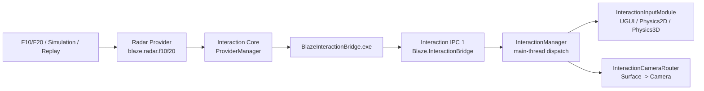

# Gate A 架构与所有权

## 唯一生产数据链



Gate A 只有一个 Windows Bridge、一个 Interaction IPC server、一个 Unity Pipe Client 和一个 EventSystem 输入实现。Radar 是 Bridge 外置 Provider，不拥有第二条生产 IPC。`Blaze.Radar` 兼容程序集只做类型/事件适配，不能启动进程或创建管道。

CameraHand 是后续 Gate，当前架构只预留 Provider API 和 `InteractionExtensions` 扩展边界，没有 CameraHand 生产模块。

## 模块职责

| 模块 | 责任 | 不负责 |
| --- | --- | --- |
| `Blaze.Interaction.Contracts` | Surface、Point、Frame、Provider identity、可选扩展 JSON 契约 | 设备连接、IPC |
| `Blaze.Interaction.Provider.Abstractions` | Provider API 1、插件/实例生命周期、状态和设置视图接口 | Provider 发现和加载 |
| `Blaze.Interaction.Runtime` | 安全目录发现、隔离加载、ProviderManager、切换/停止/取消 | Named Pipe、Unity |
| `Blaze.Provider.Radar` | 复用 RadarControl coordinator，把每屏融合输出映射为 `InteractionFrame` | 复制 Radar 算法、创建 Interaction IPC |
| `Blaze.Interaction.Ipc` | IPC 1 framing、握手、身份、心跳、背压和单客户端 session | Provider 选择策略、Unity 事件 |
| `Blaze.Interaction.Bridge.Wpf` | 发现/托管 Provider、创建 HelloAck、Provider 切换、向 IPC 转发状态/帧 | 直接解码雷达协议 |
| `com.blaze.interaction` | Bridge 启动/复用、Unity client、主线程状态、InputModule、Camera 路由、构建复制 | 雷达 TCP、雷达配置算法 |

## Radar 所有权不变

`Radar.Device`、`Radar.Protocol`、`Radar.Configuration`、`Radar.Processing` 与 `Radar.Bridge.Wpf` 仍是既有 F10/F20 行为的实现来源。Provider 模式调用同一 coordinator，但关闭 legacy Radar IPC 输出，改由回调发送 `InteractionFrame`。每个旧 `PointerBatch` screen frame 映射为一个 Interaction frame，保留：

- Surface/Screen ID；
- frame sequence 与 timestamp；
- pointer ID、phase、normalized/pixel 坐标、confidence 与 point timestamp；
- 同屏融合后的单一输出流。

适配层不会把一个 frame 拆成“每点一帧”，也不会从点坐标猜测屏幕分辨率。

## Provider 生命周期与隔离

每个 Provider 目录包含一个 `provider.json`。Catalog 先验证目录、manifest 大小、重复字段、API major、入口 DLL 与路径安全，再为每个 Provider 创建独立可回收 `AssemblyLoadContext`。Contracts 与 Provider Abstractions 从默认上下文共享；Provider 私有依赖从自己的目录解析。

ProviderManager 的成功切换顺序是：

```text
关闭旧 generation 的事件准入
-> 等待已接纳回调排空
-> 为活动点生成 Cancel
-> 退订并 Stop/Dispose 旧 Provider
-> 创建、Initialize、Start 新 Provider
-> 发布 ProviderChanged
```

同一 Provider/Surface 的 sequence 必须严格递增。嵌套回调经过容量 64 的非递归 FIFO；超出容量会被显式拒绝和诊断。生命周期回调中的同步重入会快速失败，避免生命周期锁死。

## IPC 背压与生命周期边

Bridge 只在客户端已完成 HelloAck 时接受业务帧：

- 仅含 Hover/Move 或空点列表的视觉帧采用 latest-only 合并；
- 含 Down、Up 或 Cancel 的帧进入可靠有序控制队列；
- 客户端未确认或已断开时，不把不可投递生命周期帧加入旧 session 的可靠链；
- Provider 切换/停止生成的 Cancel 必须先于对应 `ProviderChanged` 完成。

Unity 端使用同样的 `LifecycleFrameBuffer`：Down/Up/Cancel FIFO 保留，只有相邻的 Hover/Move/空视觉帧可合并；当容量 64 全被生命周期帧占满时，读取线程背压，不丢生命周期边。

## 进程、身份和部署

Unity Launcher 先探测配置的 Pipe；已有 Bridge 时复用，否则从当前 Package Manager Resolved Path 启动 `BlazeInteractionBridge.exe`，参数为 `--parent-pid`、`--pipe-name`、`--minimized`。Bridge 验证 Named Pipe 的真实客户端 PID/Windows Session 与 Hello 声明；自动启动时还必须等于 `--parent-pid`。

发布 payload 根目录恰好一个 EXE，Provider 位于 `Providers/Radar/`。Player 构建处理器先删除目标中的旧 Bridge 目录，再复制完整 payload，并校验 Bridge 版本、Provider manifest/入口 DLL 和文件 SHA-256。
