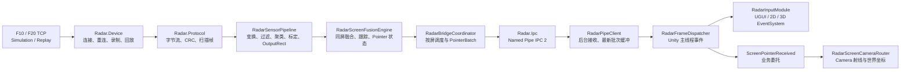

# RadarControl 代码大纲、代码介绍与修改方案

> 适用版本：RadarControl / Blaze Radar SDK `1.2.10`<br>
> 目标读者：维护 RadarBridge、Unity SDK、雷达算法、现场集成与发布流程的开发人员。

## 1. 文档目的

本文不重复安装和操作说明，而是回答维护代码时最重要的四个问题：

1. 数据从真实雷达到 Unity 的完整路径是什么；
2. 每个项目、核心类型和配置对象负责什么；
3. 修改某一类功能时必须同步修改哪些层；
4. 如何验证修改没有破坏多屏、多雷达、指针生命周期和打包后的 Bridge。

操作人员请先看[图文使用说明](user-guide.md)，Unity 接入人员请同时看[Unity 多屏集成](unity-integration.md)，协议字段请看[IPC 2 协议](protocol.md)。

## 2. 技术基线与边界

| 项目 | 当前约定 |
| --- | --- |
| RadarBridge | .NET 8、WPF、Windows x64、self-contained 发布 |
| Unity SDK | Unity 2021.3 LTS 及以上、UPM 包 `com.blaze.radar` |
| Unity 依赖 | `com.unity.ugui`、`com.unity.nuget.newtonsoft-json` |
| 雷达连接 | 每个传感器独立 TCP，支持 F10/F20、模拟和 `.radarrec` 回放 |
| 进程通信 | Windows Named Pipe，默认 `Yuexin.RadarBridge`，IPC 协议版本 2 |
| 配置 | RadarBridge Schema 2；Unity 通过 Hello 提供逻辑屏幕拓扑 |
| 公共 Unity 命名空间 | `Blaze.Radar` |
| Bridge/.NET 命名空间 | `Yuexin.Radar.*`（历史内部命名，不是 UPM 包名） |

所有权边界必须保持清晰：

- `RadarBridge.exe` 独占雷达 TCP、协议解析、每雷达处理、每屏融合、Pointer 状态机和配置持久化。
- Unity 不直接连接雷达 IP；Unity 只声明逻辑屏幕并消费按 `screenId` 分组的 `PointerBatch`。
- 一个物理雷达只属于一个逻辑屏幕；一个逻辑屏幕可以包含多个雷达。
- 多雷达去重和 Pointer ID 稳定性以逻辑屏幕为边界，不跨屏关联人员。
- `RadarScreenPointer.pixelX/pixelY` 已经是该逻辑屏幕的像素坐标；只有 Camera 使用了 `pixelRect`、多 Display 或 RenderTexture 时，才需要再通过 `RadarScreenCameraRouter` 映射到 Camera 像素空间。

## 3. 总体架构



核心数据顺序：

```text
原始 TCP 字节
→ FaseLase 数据包
→ 雷达扫描帧 RadarScanFrame
→ 坐标旋转/翻转/偏移
→ 距离、角度、拉框、屏蔽区、边线死区过滤
→ 相邻点聚类
→ 四点 Homography 标定
→ 传感器 OutputRect 像素映射
→ 同屏多雷达融合
→ 屏幕级跟踪、平滑和交互状态机
→ RadarScreenPointerFrame
→ PointerBatchPayload
→ Unity EventSystem / 用户委托 / Camera 射线
```

区域 1A 显示原始点，区域 1B 显示变换和过滤后的有效点；区域 2 显示已经映射、融合并准备发送给 Unity 的屏幕级目标和 Pointer。排查时应按这个顺序定位，不能只看最终区域 2。

## 4. 仓库代码大纲

### 4.1 Bridge 与共享 .NET 项目

| 项目 | 核心入口 | 职责 | 主要测试 |
| --- | --- | --- | --- |
| `src/Radar.Contracts` | `IpcMessages.cs`、`RadarScreenContracts.cs` | 跨模块 DTO、屏幕/Pointer 合同和 IPC 消息类型 | IPC、E2E、Unity compatibility |
| `src/Radar.Protocol` | `RadarByteStreamDecoder`、`FaseLasePacketParser`、`RadarScanFrameBuilder` | 有界字节缓存、CRC、错位重同步、扫描帧组装 | `tests/Radar.Protocol.Tests` |
| `src/Radar.Device` | `RadarConnectionService`、`RadarTcpClient`、型号 Profile | TCP 生命周期、网卡绑定、重连、录制和回放 | `tests/Radar.Device.Tests` |
| `src/Radar.Configuration` | `RadarAppConfiguration`、`RadarScreenConfiguration`、`RadarConfigurationStore` | Schema 2 配置、校验、迁移和安全持久化 | `tests/Radar.Configuration.Tests` |
| `src/Radar.Processing` | `RadarPointFilter`、`HomographyCalibration`、`RadarScreenFusionEngine` | 变换、过滤、聚类、标定、输出映射、融合和跟踪 | `tests/Radar.Processing.Tests` |
| `src/Radar.Ipc` | `RadarPipeServer`、`IpcFrameCodec` | IPC 2、Hello/HelloAck、身份校验、长度前缀 JSON | `tests/Radar.Ipc.Tests` |
| `src/Radar.Bridge.Wpf` | `App`、`RadarBridgeCoordinator`、`MainViewModel`、`MainWindow` | 组合所有运行时、WPF 控制台、日志和操作命令 | `tests/Radar.Bridge.Wpf.Tests` |

### 4.2 RadarBridge 关键类型

#### `RadarSensorPipeline`

每个雷达实例拥有一个独立 Pipeline。真实、模拟、回放三种数据源最终进入同一处理链：

```csharp
frame.Points
    -> RadarCoordinateConverter.ApplyTransform(...)
    -> RadarPointFilter.Apply(...)
    -> SequentialPointClusterer.Cluster(...)
    -> HomographyCalibration.TryMap(...)
    -> RadarOutputMapper.Map(...)
    -> SensorDetectionFrame
```

`SnapshotUpdated` 提供原始点、有效点、聚类和诊断指标给 WPF；`DetectionFrameUpdated` 只把已映射的传感器检测送入所属屏幕的融合引擎。

#### `RadarScreenFusionEngine`

这是屏幕级而不是雷达级组件，负责：

- 丢弃超过 `SensorDataMaxAgeMilliseconds` 的检测；
- 按 `FusionDistancePixels` 合并同屏多个雷达的重叠检测；
- 用 `MaximumAssociationDistancePixels` 关联连续目标；
- 使用 `ConfirmFrames`、`LostFrames` 和 `SmoothingAlpha` 稳定 Track；
- 根据 Touch/Dwell/Hover 等交互模式生成 `Hover/Down/Move/Up`。

短暂缺帧时，上一目标和 Pointer 会保留到 `LostFrames` 阈值；达到阈值后只发送一次 `Up` 并清理状态。不要在 UI 绘制层重复实现这套保持逻辑。

#### `RadarBridgeCoordinator`

Coordinator 是 Bridge 运行时总协调器：

- 接收 Unity Hello 并对齐 `screenId`、分辨率、Primary 和顺序；
- 创建/替换每屏和每雷达运行时；
- 管理连接、断开、一键模拟、录制和回放；
- 按每屏 `OutputRateHz` 调用融合引擎；
- 处理拓扑变化前的 Pointer `Up`/空帧过渡；
- 将多个屏幕帧封装成一个 `PointerBatchPayload`；
- 通过 `[SCREEN/SENSOR]`、`[GLOBAL/IPC]` 标签输出可对时日志。

### 4.3 WPF 表现层

| 文件 | 职责 |
| --- | --- |
| `MainWindow.xaml` | 主控制台布局、屏幕/雷达选项卡和命令绑定 |
| `MainViewModel.cs` | 全局命令、选中项、UI 线程切换和运行日志 |
| `ScreenItemViewModel.cs` | 分辨率、融合、跟踪和交互参数 |
| `SensorItemViewModel.cs` | 设备、变换、区域、过滤、标定、录制和回放参数 |
| `RadarPointCloudView.cs` | 区域 1 原始/过滤点及拉框绘制 |
| `RadarScreenFusionView.cs` | 区域 2 屏幕融合输出绘制 |
| `RadarRegionEditorWindow.*` | 拉框放大、缩放、平移与边角精调 |
| `FlexibleNumericTextConverter.cs` | 浮点字段的点号/逗号输入和编辑中间态 |

ViewModel 可以持有不可变快照和命令状态，但后台线程不能直接修改 WPF 控件。高频点云必须由自绘控件消费快照并限频刷新，不能为每个点创建 WPF 子控件。

### 4.4 Unity UPM 包

程序集边界：

| 程序集 | 路径 | 职责 |
| --- | --- | --- |
| `Blaze.Radar.Runtime` | `UnityPackage/com.blaze.radar/Runtime` | Player 可用的 IPC、事件、EventSystem、Camera 路由和设置 |
| `Blaze.Radar.Editor` | `UnityPackage/com.blaze.radar/Editor` | Project Settings、场景创建菜单和 Player 构建后复制 Bridge |
| Sample asmdef | `Samples~/BasicInteraction`、`Samples~/MultiScreenCameraRouting` | 可导入且不污染 Runtime 的示例代码 |

Unity Runtime 关键类型：

| 类型 | 说明 |
| --- | --- |
| `RadarRuntimeSettings` | `Resources/RadarRuntimeSettings`，保存 Bridge、连接和逻辑屏幕拓扑 |
| `RadarBridgeLauncher` | 先探测 Pipe；需要时从当前 UPM Resolved Path 启动内嵌 Bridge，并传递 Unity PID |
| `RadarPipeClient` | 后台连接、Hello/HelloAck、重连、最新批次缓冲和主线程事件队列 |
| `RadarFrameDispatcher` | 在 `Update` 消费批次，保存每屏最新帧并触发屏幕级/兼容事件 |
| `RadarInputModule` | 把雷达 Pointer 注入标准 `EventSystem.RaycastAll` 和 UGUI/2D/3D 回调 |
| `RadarScreenCameraRouter` | 将逻辑屏幕像素映射到绑定 Camera，并生成射线/Physics 命中 |
| `RadarBuildProcessor` | 构建后删除旧输出、复制完整 `Bridge~`，验证版本、marker、文件和 EXE SHA |

## 5. Unity 公共事件和坐标用法

推荐的新代码直接订阅屏幕级委托：

```csharp
using Blaze.Radar;
using UnityEngine;

public sealed class RadarPointerConsumer : MonoBehaviour
{
    [SerializeField] private RadarFrameDispatcher dispatcher;
    [SerializeField] private RadarScreenCameraRouter cameraRouter;

    private void OnEnable()
    {
        dispatcher.ScreenPointerReceived += OnScreenPointerReceived;
    }

    private void OnDisable()
    {
        dispatcher.ScreenPointerReceived -= OnScreenPointerReceived;
    }

    private void OnScreenPointerReceived(
        RadarScreenInfo screen,
        RadarScreenPointer pointer)
    {
        // 可直接用于该逻辑屏幕内的 UI/业务坐标。
        var logicalPixel = new Vector2(pointer.pixelX, pointer.pixelY);

        // 多 Display、pixelRect 或 RenderTexture 场景应交给 Router。
        if (cameraRouter.TryRaycast(screen, pointer, out var hit))
        {
            transform.position = hit.point;
        }
    }
}
```

事件选择规则：

- 新的多屏业务使用 `ScreenPointerReceived` 或 `ScreenFrameReceived`。
- 需要逐点即时业务回调时用 `ScreenPointerReceived`。
- 需要一帧内统一处理、处理零 Pointer 帧或批量绘制时用 `ScreenFrameReceived`。
- `PointerFrameReceived` 只保留给旧的单 Primary 屏项目，不应成为新功能入口。
- 订阅和取消订阅必须成对，避免场景切换后重复回调。
- `Up` 必须参与资源回收；不要只处理 `Move`，否则粒子、拖拽或按压状态会残留。

## 6. 配置模型与参数归属

### 6.1 Unity 拥有的拓扑

`RadarRuntimeSettings` / `RadarScreenDefinition` 负责：

- 稳定唯一的 `screenId`；
- 显示名称、默认逻辑分辨率、顺序；
- 启用状态和唯一 Primary；
- Bridge 自动启动、退出联动、Pipe 和超时。

Unity Hello 只发送启用的逻辑屏幕。不要在 Bridge 配置中自行创建一个 Unity 未声明的“虚拟屏幕”来绕过拓扑校验。

### 6.2 Bridge 拥有的每屏参数

`RadarScreenConfiguration` 负责：

- 跟随 Unity 或手动覆盖的有效分辨率；
- 融合输出频率、数据最大年龄、跨雷达融合距离；
- 屏幕级确认/丢失帧、关联距离和平滑；
- Touch/Dwell/Hover、点击和拖拽阈值；
- 该屏幕下的传感器集合。

### 6.3 Bridge 拥有的每雷达参数

`RadarSensorConfiguration` 负责：

- Real/Simulation/Replay、F10/F20、远端 IP/端口和本机网卡；
- 旋转、X/Y 翻转和米制偏移；
- 距离/角度、有效拉框、屏蔽多边形、四边死区；
- 聚类参数；
- 四点标定；
- 映射到所属屏幕的 `OutputRectPixels`；
- 回放文件、速度和循环。

判断参数放置层级的原则：只影响某台雷达物理点的参数属于 Sensor；影响同屏多个雷达合并结果或 Pointer 生命周期的参数属于 Screen；影响 Unity Camera 或业务表现的参数属于 Unity 场景。

## 7. 修改方案与影响范围

### 7.1 新增或修改一个配置参数

按以下顺序修改，缺一不可：

1. 在 `RadarAppConfiguration.cs` 或 `RadarScreenConfiguration.cs` 增加有默认值的配置字段；
2. 在 `ConfigurationValidator` 增加有限值、范围和组合校验；
3. 如旧配置需要转换，在 `RadarConfigurationStore` 增加明确迁移和 warning；
4. 在 `ScreenItemViewModel` 或 `SensorItemViewModel` 暴露属性和 `IDataErrorInfo`；
5. 在 `MainWindow.xaml` 绑定字段，浮点输入复用 `FlexibleNumericTextConverter`；
6. 在 `RadarSensorPipeline.SensorRuntimeOptions.Create` 或 `RadarBridgeCoordinator.CreateFusion` 映射到运行时；
7. 在算法类消费该参数；
8. 补配置往返、非法值、ViewModel 绑定、算法行为和保存/重载测试。

如果参数只出现在 XAML 中但未进入运行时 Options，它不会影响真实雷达；如果只进入算法而未进入配置持久化，重启后会恢复旧值。

### 7.2 修改原始点过滤或边线噪点方案

建议修改路径：

```text
RadarRangeConfiguration / RadarClusteringConfiguration
→ ConfigurationValidator
→ SensorItemViewModel + MainWindow.xaml
→ SensorRuntimeOptions.Create
→ RadarPointFilter / SequentialPointClusterer
→ Snapshot.ValidPoints 与 DetectionFrame
```

要求：

- 原始点集合保持不变，便于区域 1A 诊断；
- 被过滤点不能进入聚类、标定、融合和 Unity；
- 边线过滤以有效多边形真实边段计算，不假设拉框一定轴对齐；
- 四边死区和屏蔽多边形属于物理米制空间，不能用最终 Unity 像素替代；
- 为斜边、凹凸顺序、零宽死区、边界点和非有限值补测试。

### 7.3 修改快速移动、融合或区域 2 稳定性

优先修改 `RadarScreenFusionEngine` 和屏幕级配置，不要在 WPF 绘制控件或 Unity 端插值来掩盖 Bridge 的状态问题。

必须分别验证：

- 单雷达高速横移；
- 同屏双雷达重叠区只生成一个稳定 Pointer；
- 短暂空检测小于 `LostFrames` 时保持位置；
- 达到阈值后只发送一次 `Up`；
- 新目标不会错误继承已丢失目标 ID；
- 30/60 Hz 下容忍时间符合 `LostFrames / OutputRateHz`；
- 断开某个雷达不会清空同屏其他有效雷达的目标。

### 7.4 扩展 IPC 字段或消息

Bridge 和 Unity 各有一套镜像合同，必须同步：

| Bridge | Unity |
| --- | --- |
| `src/Radar.Contracts/IpcMessages.cs` | `Runtime/RadarMessageModels.cs` |
| `System.Text.Json` camelCase | Newtonsoft.Json 字段模型 |
| `IpcProtocolVersion.Current` | `RadarIpcProtocol.Version` |

兼容增加可选字段时，可以保持 IPC 2，但必须验证旧字段缺失时的默认行为。改变消息语义、帧结构或生命周期时，应提升协议版本并明确拒绝不兼容客户端，不能静默猜测。

至少补充：

- `.NET` codec 半包、粘包、非法长度和 JSON 测试；
- Bridge Hello/HelloAck 与身份边界测试；
- `Radar.Unity.Compatibility.Tests` 的 Unity 镜像反序列化测试；
- E2E 的多屏 PointerBatch 测试；
- 旧协议拒绝日志和现场排障说明。

### 7.5 扩展 Unity SDK API 或 Camera 路由

修改顺序：

1. 尽量在 `RadarFrameDispatcher` 现有屏幕级事件上扩展，不新增第二条 Pipe；
2. 保持 Pipe 后台线程只负责 I/O，所有 Unity API 调用在 `Update` 主线程发生；
3. 新的 Camera 规则进入 `RadarScreenCameraRouter`，由 `screenId` 显式绑定；
4. UGUI 行为进入 `RadarInputModule`，沿用 `PointerEventData` 和 `ExecuteEvents`；
5. 新公开能力必须在 Basic Interaction 或 Multi-Screen Camera Routing 中给出最小示例；
6. 更新 Runtime asmdef 依赖时，同时验证 Sample asmdef 和 2021.3 编译。

不要让业务代码直接访问 `RadarPipeClient` 的后台数据结构；`RadarFrameDispatcher` 是公共主线程边界。

### 7.6 修改 RadarBridge WPF 界面

遵循 MVVM 和自绘约定：

- 命令、验证和可保存状态进入 ViewModel；
- XAML 只做绑定、布局和样式；
- 高频点云进入自绘控件，不为点创建 `Ellipse`/`TextBlock` 列表；
- 右侧参数面板在 100%/125%/150% DPI 和最小支持窗口尺寸下检查；
- 深色背景上的 TextBox、Tab、CheckBox、禁用状态必须保持可读对比度；
- 点击、拖动、缩放、最小化、恢复和投影电脑焦点切换都要做清晰度冒烟测试；
- 新的异步命令必须可取消，并在 UI 线程恢复状态。

### 7.7 增加新的雷达型号

至少涉及：

1. `RadarModel` 枚举和共享合同；
2. 新的 `IRadarModelProfile` 实现及 `RadarModelProfileFactory`；
3. 若帧格式不同，扩展 Protocol parser/decoder，不在 WPF 中解析；
4. 默认配置/Profile 文件和量程校验；
5. Sensor ViewModel 的型号显示与连接说明；
6. 协议样本、CRC、扫描帧、断线重连和真实设备冒烟测试；
7. 发布包内 `profiles/` 与文档。

型号分支应在 Profile/Protocol 层结束，后续过滤、标定、融合和 Unity 输出继续使用统一的 `RadarScanFrame`/`SensorDetectionFrame`。

## 8. 并发、性能与错误处理约定

- TCP 接收、协议解析、录制写入、Pipe I/O 不得阻塞 WPF 或 Unity 主线程。
- 采集到处理、Pipe 到 Unity 都使用有界“最新值”语义；落后时丢旧帧，不无限积压。
- 丢帧必须增加 dropped 指标，不能静默消失。
- 配置替换、分辨率变化和屏幕移除前必须先完成 Pointer `Up`/空帧过渡。
- 后台回调传不可变快照；UI/Unity 线程不应遍历正在被后台修改的集合。
- 日志应包含 `screenId`、`sensorId`、batch/frame sequence、pointerId、phase、latency 或错误阶段。
- 重复错误需要节流，但首次错误、状态切换、Down/Up 不能被节流掉。
- 不捕获后完全忽略异常；可恢复错误进入状态和日志，不可恢复错误使测试或构建失败。

## 9. 测试矩阵

| 修改范围 | 最低测试要求 |
| --- | --- |
| Contracts / IPC | Contracts、IPC、Unity compatibility、E2E |
| Protocol / Device | Protocol、Device、分包/断线/重连测试 |
| Filter / Cluster / Calibration | Processing 对应单元测试 + WPF Pipeline 测试 |
| Fusion / Pointer | Processing Fusion/State tests + E2E 多屏多雷达 |
| Configuration / ViewModel / XAML | Configuration + WPF binding/layout/contrast tests |
| Unity Runtime / Editor | Unity compatibility + EditMode/PlayMode + Samples 编译 |
| Bridge 发布内容 | 完整解决方案测试 + publish + embedded smoke |

常用命令：

```powershell
dotnet test RadarControl.sln --no-restore
powershell -ExecutionPolicy Bypass -File scripts/test-unity-package.ps1 -TestPlatform All -IncludeSamples
powershell -ExecutionPolicy Bypass -File scripts/publish-bridge.ps1 -Runtime win-x64
powershell -ExecutionPolicy Bypass -File scripts/test-embedded-bridge.ps1 -StartupTimeoutSeconds 20
```

涉及真实雷达行为时，自动测试通过后仍需完成：F10/F20 真机、单屏单雷达、同屏双雷达重叠、三墙四雷达、快速挥动、边线噪点、长时间运行和 Player 构建换机测试。

## 10. 版本与发布修改清单

发布版本不是只修改 `package.json`。至少核对：

- `UnityPackage/com.blaze.radar/package.json`；
- `UnityPackage/com.blaze.radar/Runtime/UnitySdkVersion.cs`；
- `src/Radar.Bridge.Wpf/BridgeVersion.cs`；
- `src/Radar.Bridge.Wpf/Radar.Bridge.Wpf.csproj`；
- `Bridge~/win-x64/bridge-version.txt` 和完整 self-contained payload；
- CHANGELOG、README、INSTALL、UPM Documentation；
- 版本身份和发布脚本测试中的期望值；
- Git 标签、Unity 安装 URL 和 GitHub Release。

推荐发布顺序：

```text
修改版本与 CHANGELOG
→ 全量自动测试
→ 发布 win-x64 Bridge
→ 嵌入 UPM Bridge~
→ embedded smoke
→ 核对 EXE SHA-256
→ 提交并推送 main
→ 创建并推送 tag
→ 创建 GitHub Release
→ 在空 Unity 项目按 tag 安装并构建 Player
```

## 11. 修改前评审模板

每个较大修改建议先写清以下内容：

```markdown
### 问题
- 真实现场现象、版本、拓扑和复现步骤

### 数据层定位
- 原始点 / 有效点 / Detection / Fusion Target / Pointer / Unity Raycast 哪一层首次错误

### 方案
- 参数归属：Sensor / Screen / Unity
- 要修改的合同、配置、算法、UI、Unity 和文档文件
- 是否影响 IPC/Schema/版本兼容

### 安全边界
- 线程、生命周期、Pointer Up、配置迁移和旧版本行为

### 验证
- 单元测试、E2E、Unity、Bridge smoke、真实雷达和换机 Player 测试
```

先找出“第一处错误数据”，再修改该层。不要在区域 2、Unity 粒子或业务 Camera 中二次修正区域 1 已经错误的数据；也不要为了一个显示问题重写稳定的雷达处理和 IPC 链路。
