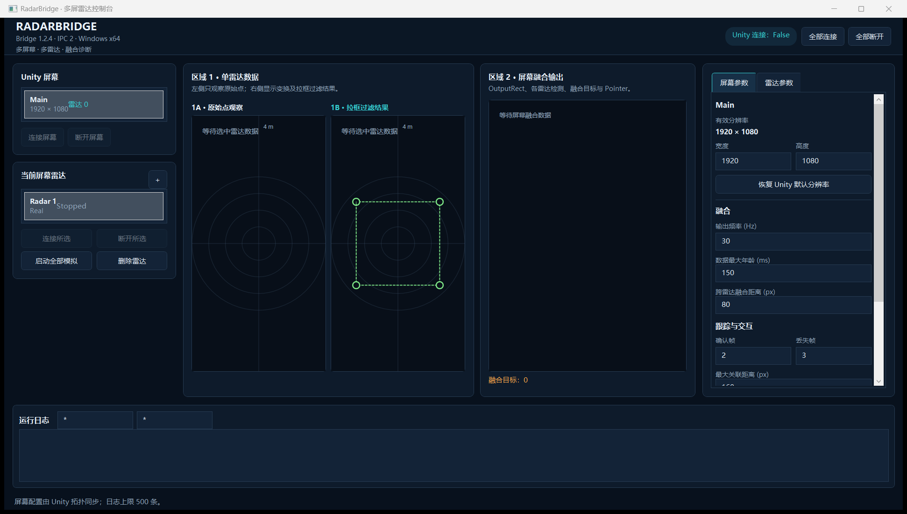
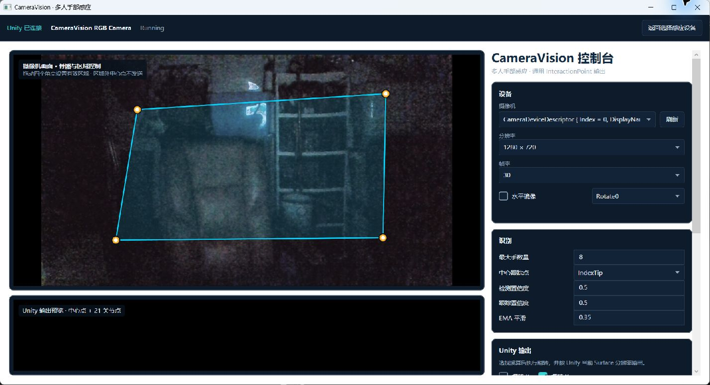
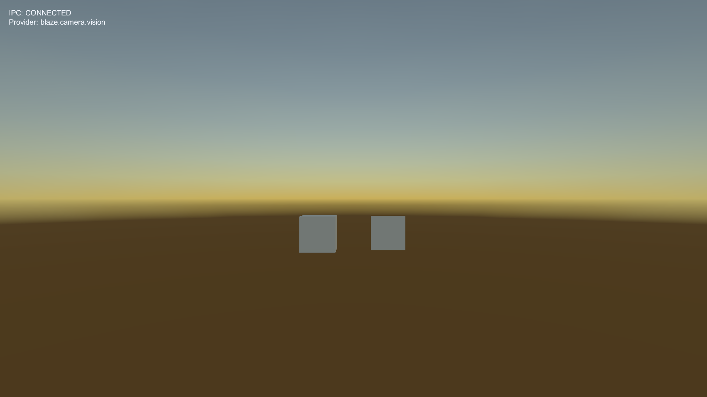

# BlazeInteraction 图文功能说明

适用版本：`1.1.1`。界面由统一 Bridge 承载；首次选择感应设备后，选择和各 Provider 配置按 Unity 项目分别保存。

## 1. Radar 控制台

Radar 页面用于真机、回放和模拟数据。顶部状态区分别显示 Unity 连接与雷达连接；Unity 未进入 Play Mode 时显示未连接是正常状态。

截图页眉中的 Radar engine/legacy IPC 版本来自被复用的 RadarControl 内部模块；Unity 生产链仍由外层 `BlazeInteractionBridge.exe` 通过 Interaction IPC 1 发送。排障时以 Package Manager、`bridge-version.txt` 和统一 Bridge HelloAck 的 `1.1.1` 为发布身份。

主要区域：

| 区域 | 作用 |
| --- | --- |
| Unity 屏幕 | 显示 Hello 中的 Surface、逻辑分辨率和连接操作 |
| 当前屏幕雷达 | 管理一块 Surface 下的一台或多台 F10/F20 |
| 原始点 | 确认设备是否确实收到点以及原始方向 |
| 拉框过滤 | 拖动有效区域、检查边缘过滤与屏蔽结果 |
| 融合/Unity 输出 | 检查聚类中心、同屏融合和最终交互点 |
| 参数 | 数据源、网络、变换、过滤、标定、跟踪和交互参数 |

无雷达时点击 **一键模拟**。Basic Interaction 会持续生成中心点以及环绕中心点的 `Fp` 粒子，粒子 0.5 秒后回收，可用于确认“Bridge → IPC → Unity → Sample”的完整链路。

真实设备调试按层定位：先看原始点，再看过滤点，再看融合输出，最后看 Unity。某层首次出现错误时修改该层参数，不要在 Unity 业务代码里二次补偿。

## 2. CameraVision 控制台

CameraVision 左侧采用主画面 + Unity 输出预览：

- **左上**：真实摄像机画面按实际比例等比缩放，留黑边，不裁切、不拉伸；同时显示骨骼点、四角控制点、边界线和有效区域。高分辨率输入会生成等比例诊断预览以降低 UI 内存压力，不影响推理或 Unity 输出坐标。
- **左下**：最终发送给 Unity 的逻辑像素预览。每只手显示 `PixelPosition` 中心点和 `Fp` 中的 21 个骨骼点。
- **右侧**：摄像头、分辨率、帧率、检测/跟踪置信度、平滑、X/Y 翻转、状态和应用按钮。

拖动左上四个控制点完成区域过滤/透视换算。X/Y 翻转不改变原始画面，而是在标定后、写入 Unity 逻辑分辨率时换算。因此左下预览必须与 Unity 收到的点位一致。

摄像头下拉框变更后会读取该设备已保存的分辨率、帧率、镜像和旋转；检测置信度、跟踪置信度、手数与平滑参数属于当前 Unity 项目的 CameraVision 全局设置。摄像头、分辨率、镜像或旋转改变时会清除旧四角标定，避免旧像素坐标污染新画面；需要在新画面上重新拉取区域。当前版本不区分左右手，也不在 SDK 层固定两只手上限。

## 3. 设备选择与切换

首次运行显示 Radar/CameraVision 选择页。选择后：

1. `bridge-settings.json` 记录 Provider ID；
2. Provider 自己的配置写入当前项目数据目录；
3. 下次运行自动加载并连接该模式；
4. 控制台中的“返回/切换感应设备”可回到选择页。

切换 Provider 会先停止旧 Provider、清理活动点并发送 Cancel，再启动新 Provider；Unity 不需要替换 Runtime 或 Pipe Client。

## 4. Unity Basic Interaction

Sample 用同一套通用代码消费两种设备：

- `PixelPosition` 驱动主光标和 UGUI/Physics 命中；
- `Fp` 逐点生成短生命周期粒子；
- Camera 的结构化手扩展可以额外绘制骨骼，但通用交互不依赖它；
- 状态文字显示 IPC、Provider、点数和丢帧计数。

Radar 与 CameraVision 切换时，场景对象和 `InteractionManager` API 不变。

## 5. 状态判断

| 状态 | 含义 |
| --- | --- |
| Unity 连接 False | Bridge 未收到当前 Unity 项目的 Hello；检查 Play Mode、Runtime、Pipe 和版本 |
| 设备 Connected，Unity False | 设备侧运行，但没有 Unity 消费者 |
| Unity True，检测点 0 | IPC 正常，目前没有通过过滤的目标 |
| Output FPS 0 | Provider 没有产生有效输出；按原始画面/过滤/推理状态向上排查 |
| 丢帧增长 | 视觉帧被 latest-only 合并；Down/Up/Cancel 仍走可靠队列 |

详细排障见 [troubleshooting.md](troubleshooting.md)。
